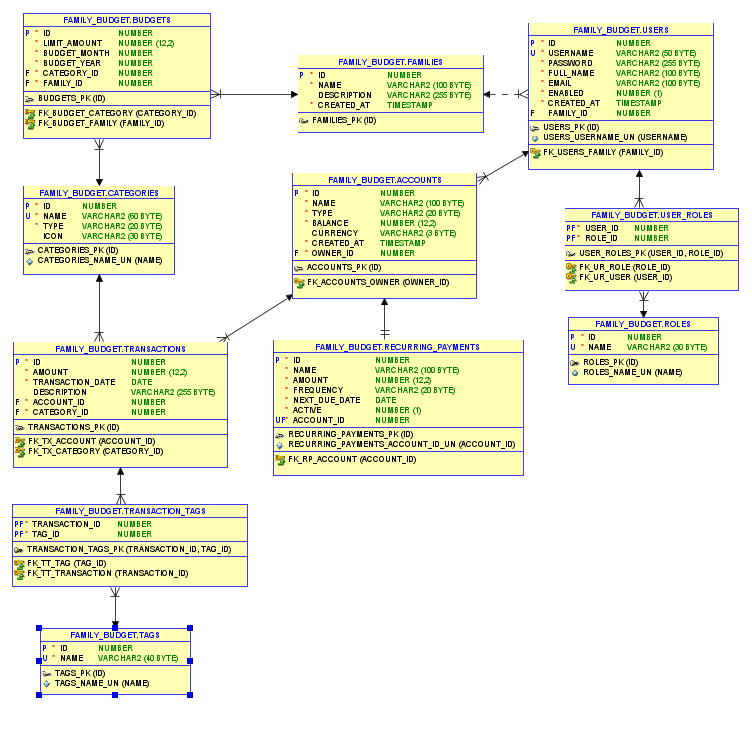
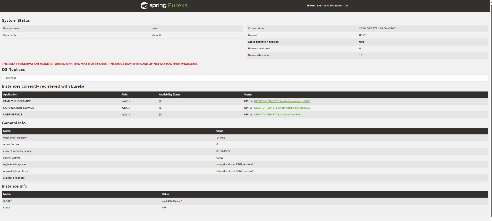
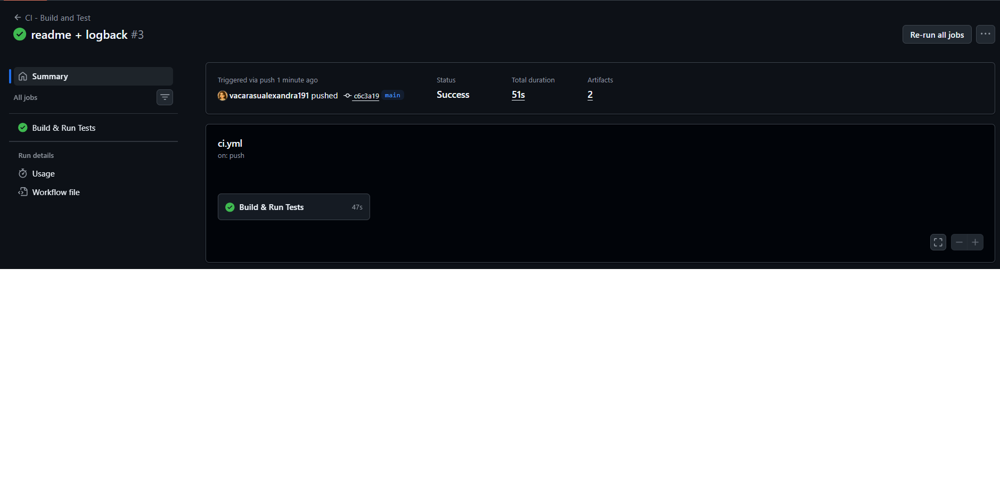

# family-budget
Aplicație web pentru gestionarea bugetului unei familii

## Cuprins

- [Descrierea Proiectului](#-descrierea-proiectului)
- [Arhitectură](#-arhitectură)
- [Diagrama ER](#-diagrama-er)
- [Setup Instructions](#-setup-instructions)
- [Funcționalități și Cerințe Implementate](#-funcționalități-și-cerințe-implementate)
- [API Documentation](#-api-documentation)
- [Screenshots](#-screenshots)
- [Testare](#-testare)
- [Monitorizare](#-monitorizare)
- [Securitate](#-securitate)
- [Contribuții](#-contribuții)
- [AI in Development](#-ai-in-development)

## Descrierea Proiectului

Family Budget App permite membrilor unei familii sa:
- Gestioneze conturi bancare și numerar 
- Inregistreze venituri și cheltuieli, organizate pe categorii
- Definească bugete lunare per categorie, la nivel de familie
- Urmărească automat progresul cheltuielilor față de bugetele stabilite
- Vizualizeze istoricul tranzacțiilor, cu filtrare, sortare și paginare
- Eticheteze tranzacții cu taguri libere (ex:"urgent")
- Configureze plați recurente (abonamente, facturi)

## Motivul alegerii temei aplicatiei
Am ales sa dezvolt aceasta aplicatie din pasiunea pentru finante si preocuparea optimizarii lor in mod cat mai eficient. Lucrez in domeniul financiar-bancar si observ foarte multe greseli in gestionarea finantelor personale. Am considerat ca o
aplicatie de gestionare a bugetului unei familii este esentiala pentru a asigura stabilitatea financiara si pentru a atinge obiectivele financiare pe termen lung. O aplicatie care sa ajute la organizarea veniturilor, cheltuielilor si bugetelor poate fi un instrument valoros pentru familii, oferindu-le o mai buna vizibilitate asupra situatiei lor financiare si facilitand luarea deciziilor informate.


## Arhitectură
### Model de Date
| Entitate | Descriere | Relații |
|----------|-----------|---------|
| `Family` | Grupează membrii familiei | 1→N `User`, 1→N `Budget` |
| `User` | Membru al familiei, cu cont de login | N→1 `Family`, N→N `Role`, 1→N `Account` |
| `Role` | Rol de securitate | N→N `User` |
| `Account` | Cont bancar/numerar | N→1 `User`, 1→N `Transaction`, 1→1 `RecurringPayment` |
| `Category` | Categorie venit/cheltuială | 1→N `Transaction`, 1→N `Budget` |
| `Transaction` | Tranzacție financiară | N→1 `Account`, N→1 `Category`, N→N `Tag` |
| `Budget` | Limită lunară per categorie/familie | N→1 `Category`, N→1 `Family` |
| `Tag` | Etichetă liberă | N→N `Transaction` |
| `RecurringPayment` | Plată recurentă | 1→1 `Account` |

### Diagrama ER


## Tehnologii Utilizate

### Limbaj și mediu de execuție
- **Java 21 (JDK)** 
- **Maven 3.8+** 

### Framework și persistență
- **Spring Boot 3.3.4** — framework principal 
- **Spring MVC** — gestionarea cererilor HTTP si controllerelor
- **Spring Data JPA** — abstractizare peste accesul la date
- **Hibernate** — implementarea ORM (Object-Relational Mapping)
- **Spring Validation (Bean Validation / JSR-380)** — validare server-side cu `@Valid`, `@NotNull`, `@NotBlank`, `@Positive`, `@Email`
### Bază de date
- **Oracle Database XE 21c** (sau altă ediție compatibilă) — bază de date relațională pentru profilul `dev`
- **Oracle SQL Developer** — client folosit pentru administrarea schemei, rulare scripturi SQL și generarea diagramei ER
- **H2 Database** (in-memory) — bază de date izolată folosită exclusiv pentru profilul `test`
- **Oracle JDBC Driver (ojdbc11)** — driver de conectare
- 
### Securitate
- **Spring Security 6** — autentificare și autorizare
- **JdbcUserDetailsManager** — autentificare JDBC cu query-uri SQL custom
- **BCrypt** — hashing parole
- **CSRF Protection** — activă implicit (token integrat în formularele Thymeleaf)

### Frontend
- **Thymeleaf** — pentru generarea paginilor HTML
- **Thymeleaf Extras Spring Security 6** 
- **Bootstrap 5.3** 
- **Bootstrap Icons** 
- **JavaScript (vanilla)** 

### Logging și monitorizare
- **SLF4J** 
- **Logback** 
- **Spring Boot Actuator** — expunere endpoint-uri de health-check și metrici

### Testare
- **JUnit 5** — framework de testare
- **Mockito** — mocking pentru teste unitare de service layer
- **Spring Boot Test** (`@SpringBootTest`) — Tests run: 14, Failures: 0, Errors: 0, Skipped: 0 - BUILD SUCCESS
- **AssertJ**
```
[INFO] Tests run: 6, Failures: 0, Errors: 0, Skipped: 0, Time elapsed: 0.197 s -- in com.familybudget.service.TransactionServiceTest
[INFO]
[INFO] Results:
[INFO]
[INFO] Tests run: 14, Failures: 0, Errors: 0, Skipped: 0
[INFO]
[INFO] ------------------------------------------------------------------------
[INFO] BUILD SUCCESS
[INFO] ------------------------------------------------------------------------
```

### Multi-environment
Două profile Spring complet separate:
- **`dev`** → Oracle XE, `ddl-auto: update`, logging DEBUG
- **`test`** → H2 in-memory, `ddl-auto: create-drop`, logging INFO

### Coduri de eroare

| Cod | Cauză | Pagină afișată |
|-----|-------|-----------------|
| 404 | Resursă inexistentă (`ResourceNotFoundException`) | `error/404.html` |
| 403 | Acces interzis pe baza rolului | `error/403.html` |
| 409 | Conflict / resursă duplicată (`DuplicateResourceException`) | `error/generic.html` |
| 500 | Eroare neașteptată | `error/500.html` |
### Structura Proiectului

```


src/
├── main/
│   ├── java/com/familybudget/
│   │   ├── controller/      #  MVC 
│   │   ├── dto/              # DTO-uri pentru formulare (cu validare Bean Validation)
│   │   ├── entity/            # 8 entități JPA
│   │   ├── exception/        # Excepții custom + GlobalExceptionHandler centralizat
│   │   ├── repository/       # Spring Data JPA repositories (cu Pageable + Sort)
│   │   ├── security/         # SecurityConfig (JDBC auth, BCrypt, roluri)
│   │   └── service/          # logică de business
│   └── resources/
│       ├── templates/        
│       ├── static/           
│       ├── application.yml          
│       ├── application-dev.yml      # Profil Oracle (dezvoltare)
│       ├── application-test.yml     # Profil H2 (testare)
│       └── logback-spring.xml       # Configurare logging
└── test/
    └── java/com/familybudget/
        ├── service/           # Unit tests (Mockito) 
        └── integration/       # Integration tests end-to-end (H2)
```
---
## Arhitectura Microservicii

### Decompoziție — 3+ servicii independente

| Serviciu | Port | Rol | Tehnologii |
|----------|------|-----|------------|
| **eureka-server** | 8761 | Service Registry — toate celelalte servicii se înregistrează și se descoperă prin el | Spring Cloud Netflix Eureka Server |
| **user-service** | 8081 | Microserviciu independent pentru autentificare și gestionarea utilizatorilor (API REST) | Spring Boot, Spring Data JPA, Eureka Client |
| **notification-service** | 8083 | Microserviciu independent pentru notificări (simulate) legate de evenimente financiare | Spring Boot, Eureka Client |
| **family-budget-app** (monolit) | 8080 | Aplicația principală (toate entitățile de business) — înregistrată și ea în Eureka ca al 3-lea/4-lea serviciu vizibil | Spring Boot, Eureka Client + tot stack-ul descris mai sus 
|
**La pornirea simultană a celor 4 aplicații (eureka-server → user-service → notification-service → family-budget-app), dashboard-ul Eureka (`http://localhost:8761`) listează automat toate instanțele ca `UP`, fără nicio configurare manuală de rutare:


### 2. API expus de microservicii independente

**user-service** (`http://localhost:8081`)

| Metodă | Endpoint | Descriere |
|--------|----------|-----------|
| GET | `/api/users` | Lista tuturor utilizatorilor (fără parole expuse) |
| GET | `/api/users/{id}` | Detalii utilizator după ID |
| GET | `/api/users/by-username/{username}` | Detalii utilizator după username |
| POST | `/api/users/authenticate` | Verifică credențiale (username + password) și returnează datele utilizatorului |

**notification-service** (`http://localhost:8083`)

| Metodă | Endpoint | Descriere |
|--------|----------|-----------|
| POST | `/api/notifications` | Trimite (simulat, prin logging) o notificare către un utilizator |
| GET | `/api/notifications/history` | Istoricul notificărilor trimise în sesiunea curentă |

### Monitorizare (Actuator)

| Metodă | Endpoint | Rol | Descriere |
|--------|----------|-----|-----------|
| GET | `/actuator/health` | Public | Status aplicație + DB |
| GET | `/actuator/info` | Autentificat | Informații aplicație |
| GET | `/actuator/metrics` | Autentificat | Metrici runtime JVM/HTTP |

## CI/CD Pipeline

Proiectul folosește **GitHub Actions** pentru integrare continuă, configurat în `.github/workflows/ci.yml`.

La fiecare `push` sau `Pull Request` pe `main` sau `dev`, GitHub rulează automat, în cloud:

- **Build automatizat** 
- **Rulare teste automate** 
- **Deployment-ready artifact** — fiecare build de succes produce un `.jar` descărcabil
  Status-ul ultimei rulări poate fi verificat în tab-ul **Actions** al repository-ului: https://github.com/vacarasualexandra191/family-budget/actions



## AI Agents

Aplicația include o funcționalitate AI integrată la runtime, vizibilă utilizatorului final: **Asistentul Financiar** (`/advisor`).
Un motor de recomandări personalizate care analizează în timp real tranzacțiile și bugetele reale ale utilizatorului autentificat și generează sfaturi financiare automate, similar unui agent de analiză comportamentală:
- **Detectare deficit** — avertizează când cheltuielile lunii curente depașesc veniturile
- **Analiza ratei de economisire** — compară cu reperul standard de 20% recomandat de specialiști financiari
- **Categorii fără buget** — identifică automat categoriile cu cheltuieli semnificative (>50 RON) care nu au un buget lunar definit
- **Alerte de prag de buget** — semnalează bugetele depășite (100%+) sau aproape consumate (≥85%)
- **Feedback pozitiv** — confirmă când situația financiară e echilibrată, fără alerte negative